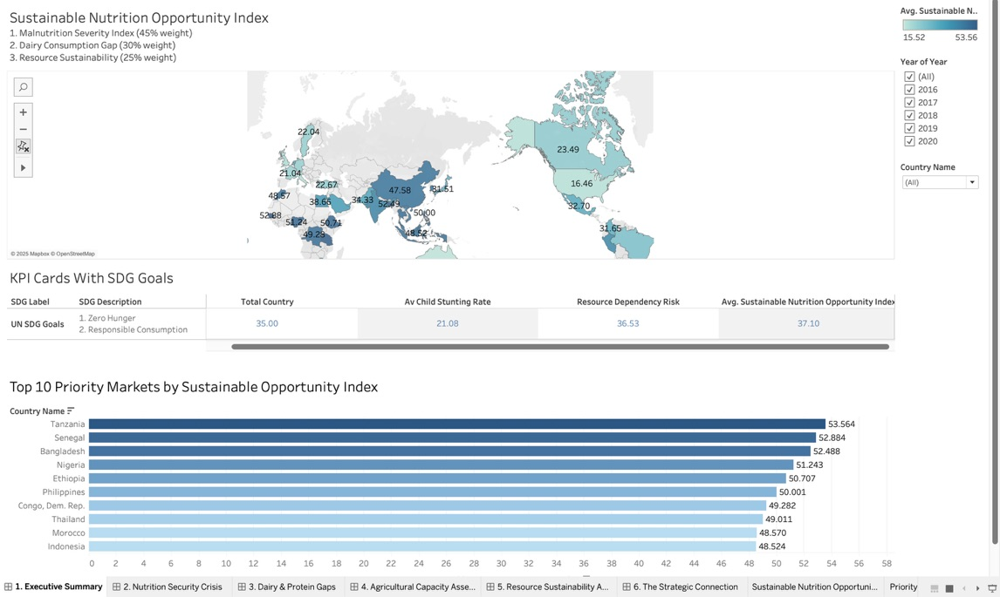
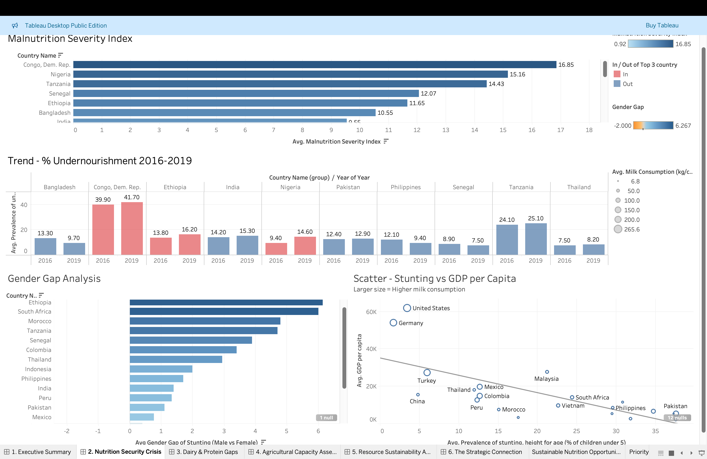
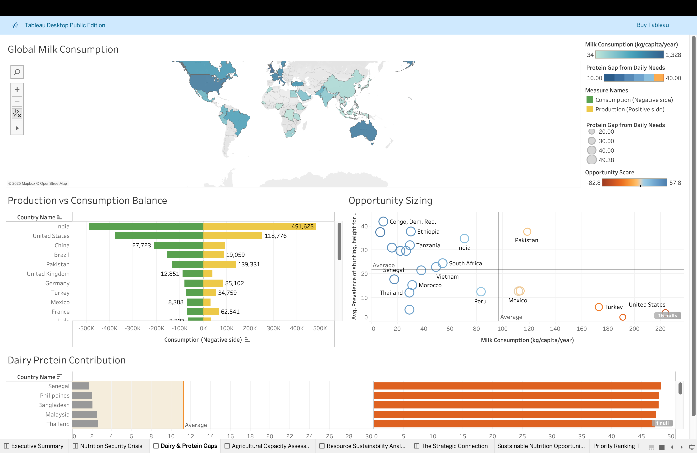
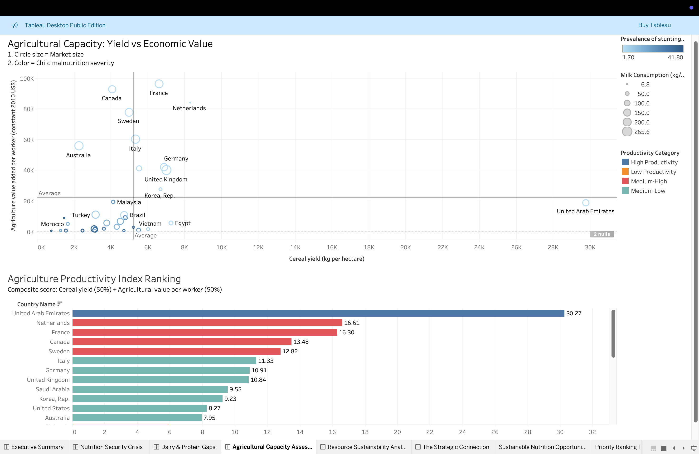
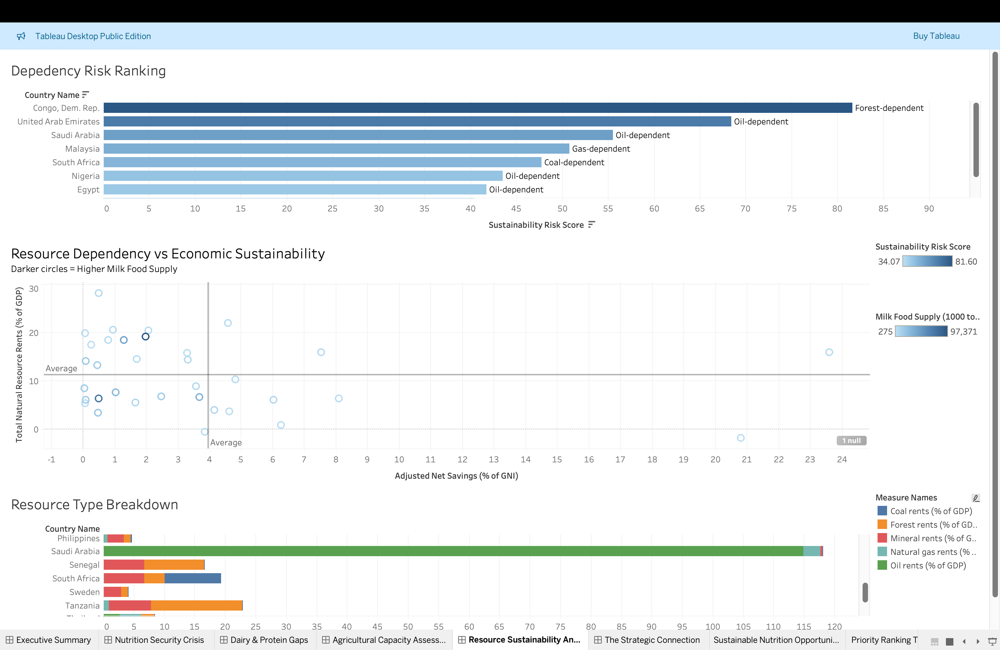
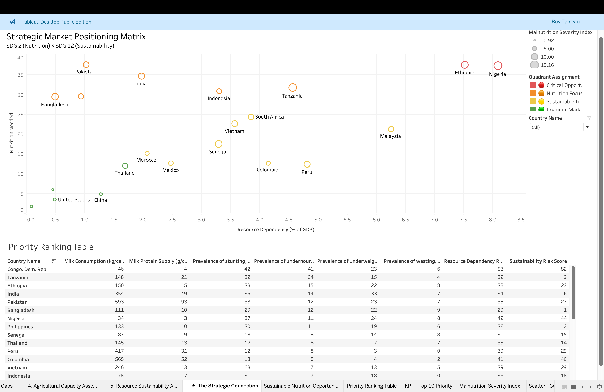

# Sustainable Nutrition Market Intelligence — A Tableau BI Case Study on Danone

> Where should a $26B global nutrition company expand next, to maximise social impact, commercial viability, and environmental sustainability?
> A 6-dashboard Tableau solution built on 35 countries × 5 years of World Bank & FAO data, aligned to **UN SDG 2** (Zero Hunger) and **SDG 12** (Responsible Consumption).


---

## TL;DR

A decision-support dashboard for **Danone's** market-expansion team, framing market selection as a **three-way optimisation** between nutritional need, dairy market gap, and resource sustainability.

- **180 country-year observations** across 36 variables, integrated from World Bank SDG and FAO Food Balances databases.
- **5 custom composite indices** built in Tableau (calc fields documented in `/docs/calculated_fields.md`).
- **6-page narrative dashboard** taking executives from "where to look" → "why these markets" → "how to prioritise" via a 2×2 strategic matrix.
- Top-3 priority markets identified: **Tanzania, Senegal, Bangladesh**, quantified through the *Sustainable Nutrition Opportunity Index*.

**[View interactive dashboard on Tableau Public →](https://public.tableau.com/app/profile/YOUR-PROFILE)** *(see "Publish" step in setup)*
**[Read the full analytical report (PDF) →](./report/Danone_Sustainable_Nutrition_BI_Report.pdf)**

---

## Dashboard Walkthrough

The six dashboards are built as a deliberate narrative arc from *Where to look → Why → How to prioritise.*

### 1 · Executive Summary — *"Where should we look?"*
The Sustainable Nutrition Opportunity Index plotted on a world map, four headline KPIs, and the Top 10 priority markets ranked. **Tanzania (53.6), Senegal (52.9), Bangladesh (52.5)** emerge as the top expansion candidates.



### 2 · Nutrition Security Crisis — *Quantifying the humanitarian case*
Malnutrition Severity Index rankings, 2016–2019 undernourishment trend (Congo's rise from 39.9% → 41.7% is the headline), Gender Gap analysis, and the GDP-vs-Stunting scatter that reveals the distribution paradox.



### 3 · Dairy & Protein Gaps — *Sizing the market opportunity*
Global consumption choropleth, Production-vs-Consumption balance, Opportunity Sizing scatter (the "golden quadrant" of high-stunting/low-consumption markets), and the Dairy Protein Contribution bar showing where intake falls below the 10.94 g/day average.



### 4 · Agricultural Capacity Assessment — *Can supply chains support entry?*
Cereal yield vs. agricultural value-added per worker, with circle size encoding market size and colour encoding stunting severity. The Agricultural Productivity Index ranking quantifies the 40× gap between UAE and Congo DRC.



### 5 · Resource Sustainability Analysis — *The SDG 12 constraint*
Resource Dependency rankings labelled by resource type (oil-, forest-, gas-, coal-dependent), the Resource Rents vs. Adjusted Net Savings scatter exposing the "resource curse" cluster, and the resource-type composition breakdown.



### 6 · The Strategic Connection — *"How do we prioritise?"*
The 2×2 matrix synthesising everything: **Critical Opportunity** (Ethiopia, Nigeria — red), **Nutrition Focus** (Bangladesh, India, Pakistan, Indonesia, Tanzania — orange), **Sustainable Transition** (Saudi Arabia, UAE — yellow), **Premium Markets** (USA, China — green). The Priority Ranking Table below surfaces every underlying metric for drill-down.



---

## The Business Problem

Danone's mission ("One Planet. One Health") sits at a structural tension: the company must grow its emerging-market footprint to address the **150.2 million children under five suffering from stunting globally**, while the dairy industry is simultaneously projected to consume **70% of allowable greenhouse-gas emissions by 2050**.

A naïve expansion strategy, chase the largest nutritional gaps, risks accelerating environmental damage in fragile economies. A purely ESG-driven strategy risks abandoning the populations the SDGs were designed to serve. The strategic question this project answers:

> *How can Danone systematically identify markets where nutritional intervention delivers maximum social impact within commercially and environmentally sustainable boundaries?*

---

## Data

| Source | Indicators | Coverage |
| --- | --- | --- |
| World Bank — Sustainable Development Goals DB | 29 | 35 countries, 2016–2020 |
| FAO — Food Balances Statistics | 4 (dairy supply & protein) | Same |
| World Bank — GDP & macro indicators | 3 | Same |

**Geographic spread:** 9 regions — Europe (6), Sub-Saharan Africa (6), Southeast Asia (5), MENA (5), Latin America (4), East Asia (3), South Asia (3), North America (2), Oceania (1).

### Data Preparation & Highlights
- **Schema reconciliation:** World Bank arrived in wide format (pivot → long); FAO required the inverse (long → wide for dairy indicators).
- **Country-name harmonisation:** 7 country labels reconciled across sources.
- **Null handling:** Missing values left explicit rather than imputed, country-level malnutrition gaps are *systematic*, not random, and imputation would obscure exactly the markets that matter most.
- **Join strategy:** Tableau relationship model (Country Name + ISO3 + Year) preserved 35 countries; an inner-join pre-merge would have dropped coverage to ~25.

### Honest Data Quality Note
Overall completeness is **55.8%** (SDG 12: 96%, FAO dairy: 92%, SDG 2 nutrition: 40% — biennial surveys). The dashboard is positioned as a **strategic screening tool**, not an operational-planning system. This limitation is treated explicitly in the report and visible in the dashboard.

---

## The Five Composite Indices

Each index is a deliberately weighted, 0–100 normalised metric. Full formulas, weightings, and rationale in [`/docs/calculated_fields.md`](./docs/calculated_fields.md).

| Index | What it measures | Top weighting |
| --- | --- | --- |
| **Malnutrition Severity Index** | Aggregate nutrition crisis severity | Undernourishment (30%) |
| **Resource Dependency Risk Score** | Extractive-economy exposure | Resource rents (60%) |
| **Agricultural Productivity Index** | Supply-chain readiness | Yield + value-added (50/50) |
| **Sustainability Risk Score** | Capital depletion vulnerability | Net savings (40%, inverted) |
| **Sustainable Nutrition Opportunity Index** | Composite of the above three — the primary KPI | Malnutrition (45%) + Dairy Gap (30%) + Sustainability (25%) |

---

## Key Insights Generated

**1. The Distribution Paradox.** India, Pakistan, and Colombia consume >100 kg dairy/capita/year yet show stunting >20%. This is **not** a production problem — it's distribution. Implication: Danone's competitive advantage in these markets is logistics and fortification, not infrastructure.

**2. The Governance Paradox.** Brazil and Turkey have weak agricultural productivity but *low* stunting. Programmes like *Bolsa Família* and Turkey's Social Assistance Foundation compensate for ag-sector inefficiency. Implication: country selection cannot rely on ag-capacity alone; institutional infrastructure matters more.

**3. The Gender Distribution Asymmetry.** Male stunting risk runs higher in most countries (Nigeria +6.27pp, Ethiopia +6.15pp) — but Vietnam and Malaysia show *reversed* patterns. Suggests intra-household food allocation is culturally, not biologically, driven.

**4. The Sustainability/Opportunity Trade-off.** The highest-need markets (Congo DRC, Ethiopia, Nigeria) overlap heavily with the highest sustainability risk. Bangladesh is the strategic anomaly: high need, *positive* adjusted net savings, viable for scale.

---

## 🧭 Strategic Output: The 2×2 Matrix

The final dashboard page segments all 35 countries into four playbooks:

| Quadrant | Markets | Strategy |
| --- | --- | --- |
| **Nutrition Focus** | Bangladesh, India, Pakistan, Philippines, Indonesia | Affordable fortified products via existing supply chains |
| **Critical Opportunity** | Congo DRC, Ethiopia, Nigeria, Tanzania | Partnership-led entry (DFIs, smallholder cooperatives, regenerative agriculture) |
| **Sustainable Transition** | Saudi Arabia, UAE | Premium ESG-branded products |
| **Premium Innovation** | China, Thailand, Turkey | Functional/personalised micronutrient products |

Recommended phasing: **Nutrition Focus markets 2025–2027**, **Critical Opportunity 2028–2030** — capacity-building before complexity.

---

## Tech Stack

- **Tableau Desktop** — relationship modelling, calculated fields, dashboard actions, parameter controls
- **Data sources:** World Bank Open Data API exports, FAOSTAT Food Balances, supplementary GDP
- **Methodology framework:** UN SDG indicator system, WHO malnutrition thresholds, FAIRR ESG benchmarks

---

## Repository Structure

```
.
├── README.md
├── dashboard/
│   └── sustainable_nutrition_dashboard.twbx   # Packaged Tableau workbook(open in Tableau Desktop / Public / Reader)
├── data/
│   ├── raw/                                   # Original World Bank & FAO exports
│   ├── processed/                             # Cleaned, merged country-year dataset
│   └── data_dictionary.md                     # Variable definitions and sources
├── docs/
│   ├── calculated_fields.md                   # All 5 indices with formulas, weightings, rationale
│   ├── data_preparation_notes.md              # Cleaning decisions and join logic
│   └── methodology.md                         # SDG framework choices & limitations
├── report/
│   └── Danone_Sustainable_Nutrition_BI_Report.pdf
└── assets/
    └── *.png                                  # Dashboard screenshots used in this README
```

---

## How to Explore

**Option 1 — Interactive (recommended):** [Open on Tableau Public](https://public.tableau.com/app/profile/YOUR-PROFILE)

**Option 2 — Local:**
1. Install [Tableau Desktop](https://www.tableau.com/products/desktop) (free 14-day trial) or [Tableau Reader](https://www.tableau.com/products/reader) (free, viewing only).
2. Open `dashboard/sustainable_nutrition_dashboard.twbx`.
3. Start on dashboard *"1. Executive Summary"* and use the bottom navigation buttons to step through the narrative.

**Option 3 — Read-only:** the full analytical report PDF in `/report` walks through every insight with embedded screenshots.

---

## Ethical & Methodological Reflection

This is a portfolio piece, not a policy paper — but the report engages seriously with the limits of what BI of this kind can claim. Three honest constraints:

1. **Country-level aggregation hides within-country inequality.** India's national stunting figure obscures stark urban-rural divides.
2. **The Sustainable Nutrition Opportunity Index has a built-in commercial bias.** Congo DRC scores lower despite higher absolute need, because high sustainability risk acts as a deterrent. This raises a real question about whether composite KPIs adequately serve the "leave no one behind" principle.
3. **Data collection itself is biased.** World Bank and FAO datasets systematically under-cover marginalised populations. Any production deployment of this framework should integrate qualitative inputs from local NGOs.

Naming these limits is not optional in BI work, it's the difference between a dashboard and a defensible decision tool.

---

## About 

Built as part of an MSc Business Intelligence Practice course at the University of Glasgow, Adam Smith Business School. Methodology, indices, dashboard architecture, and strategic recommendations are my own work.

**Open to roles in:** Data Analytics · Business Intelligence · Data Science · Insight & Strategy

- [LinkedIn](https://www.linkedin.com/in/lucasle68/)
- [GitHub](https://github.com/lucasle68-git)

---

*Datasets used under the terms of the World Bank Open Data licence and FAO data dissemination policy. Danone is referenced as a publicly listed strategic case; no proprietary company data was used.*
