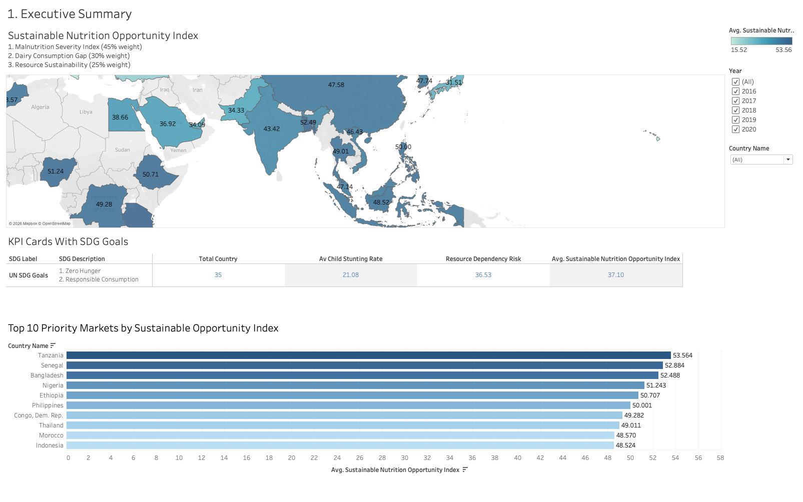
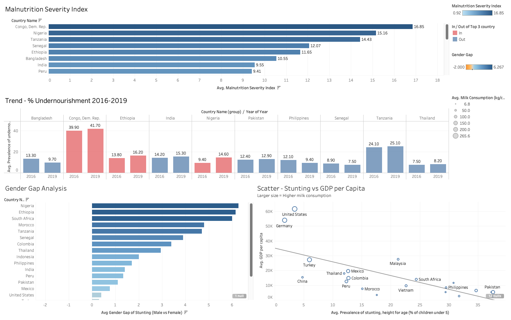
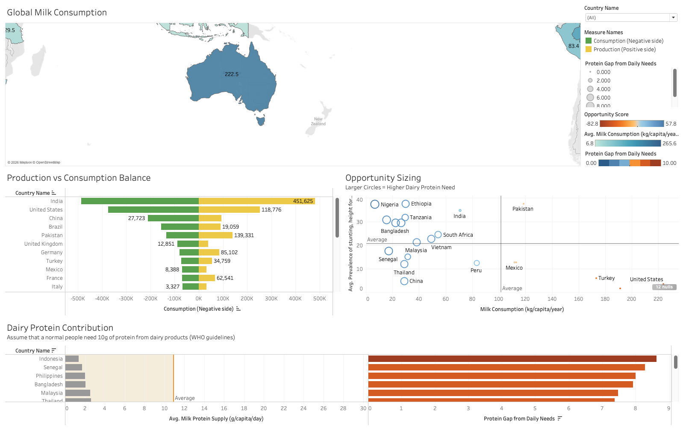
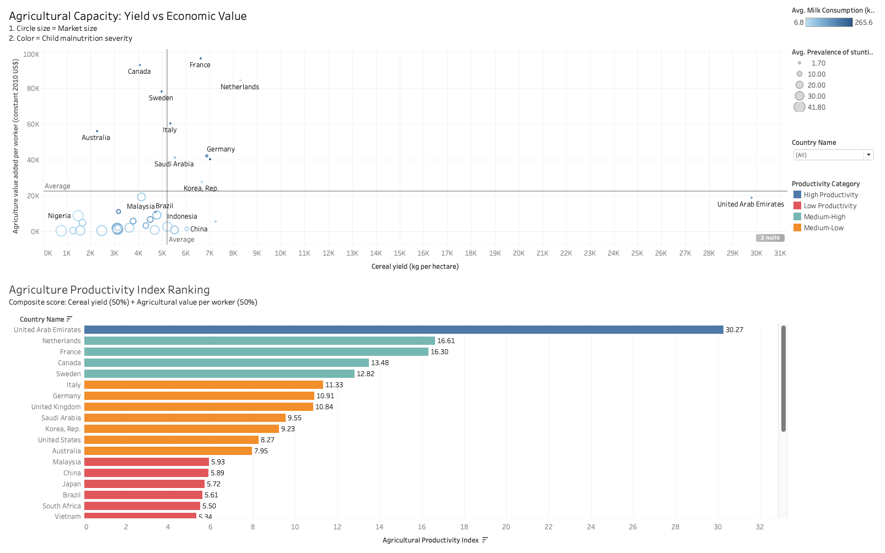
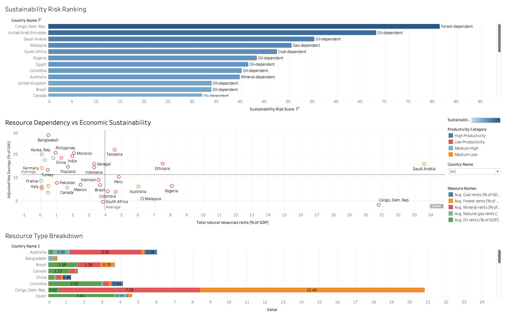
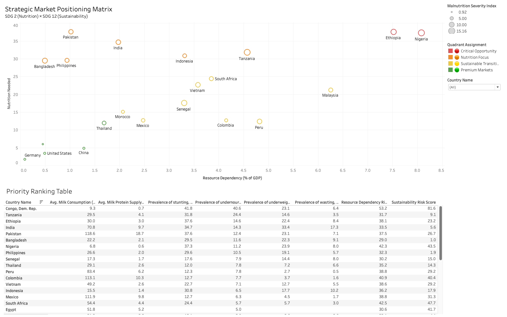

# Sustainable Nutrition Market Intelligence: a Tableau BI Case Study on Danone

> **Business question:** Where should a global nutrition company expand next to maximise social impact while staying commercially viable and environmentally sustainable?


**[▶ Open the interactive dashboard on Tableau Public](https://public.tableau.com/app/profile/lucas.le1261/viz/SustainableNutritionMarketIntelligenceDanoneCaseStudy/1_ExecutiveSummary)** · **[View the 12-slide summary (PDF)](./Danone_BI_Case_Study_Slides.pdf)**



## At a Glance

| | |
|---|---|
| **Problem** | Danone must grow in emerging markets where child malnutrition is high, without expanding into economies with fragile, resource-dependent growth. |
| **What I built** | A 6-page Tableau story on 180 country-year records (35 countries, 2016–2020) joined from 3 World Bank and FAO sources, with 4 weighted composite indices and a 2×2 market-prioritisation matrix. |
| **Answer** | Top 3 expansion candidates: **Tanzania (53.6), Senegal (52.9), Bangladesh (52.5)** on the Sustainable Nutrition Opportunity Index. Six markets form the recommended first wave ("Nutrition Focus"). |
| **Skills shown** | Data cleansing and reshaping, data modelling (Tableau relationships), calculated fields and LOD expressions, KPI design, dashboard design and storytelling, stakeholder-ready recommendations, documenting data quality limits |

## Skills Demonstrated

| Skill | Where to see it |
|---|---|
| Data cleansing & integration | Wide-to-long and long-to-wide reshaping, 7 country names harmonised, 3 sources joined ([data dictionary](./data/data_dictionary.md)) |
| Data modelling | Tableau relationship model on Country + ISO3 + Year, keeping all 35 countries instead of ~25 with an inner join |
| Calculated fields | 4 composite indices, quadrant logic, gap and balance measures, table-scoped LOD (`{MAX(...)}`) for scaling ([formulas](./docs/calculated_fields.md)) |
| Dashboard design | 6 linked dashboards: map, KPI cards, ranked bars, diverging bars, scatter plots, 2×2 matrix, drill-down table |
| Analytical storytelling | Narrative from "where to look" → "why these markets" → "how to prioritise" |
| Data quality & honesty | Completeness measured per indicator (55.8% overall) and limitations stated in the dashboard and report |

## Dashboard Walkthrough

The six dashboards follow one narrative: *where to look → why → how to prioritise.*

| # | Dashboard | Question it answers | Key visual |
|---|---|---|---|
| 1 | Executive Summary | Where should we look? | Opportunity Index map, KPI cards, Top 10 markets |
| 2 | Nutrition Security Crisis | How severe is the need? | Malnutrition ranking, undernourishment trend, gender gap, GDP vs stunting |
| 3 | Dairy & Protein Gaps | How big is the market gap? | Consumption map, production vs consumption, opportunity sizing |
| 4 | Agricultural Capacity | Can supply chains support entry? | Cereal yield vs value added per worker |
| 5 | Resource Sustainability | Is the economy's growth sustainable? | Resource rents vs adjusted net savings, resource type mix |
| 6 | Strategic Connection | How do we prioritise? | 2×2 matrix + priority ranking table |

<details>
<summary><b>See all six dashboards</b></summary>

### 2 · Nutrition Security Crisis
Malnutrition Severity Index ranking, the 2016–2019 undernourishment trend (Congo DRC rising from 39.9% to 41.7%), the gender gap in stunting, and the GDP-vs-stunting scatter that reveals the distribution paradox.



### 3 · Dairy & Protein Gaps
Consumption map, production-vs-consumption balance, the opportunity-sizing scatter (high stunting, low consumption) and dairy protein contribution against the 10.94 g/day average.



### 4 · Agricultural Capacity Assessment
Cereal yield vs agricultural value added per worker, with circle size for market size and colour for stunting severity.



### 5 · Resource Sustainability Analysis
Resource dependency ranking by dominant resource type, and resource rents vs adjusted net savings, exposing the "resource curse" cluster.



### 6 · The Strategic Connection
The 2×2 matrix that turns the analysis into four market playbooks, with the priority ranking table for drill-down.



</details>

## Key Insights

1. **Distribution paradox.** Pakistan and Colombia consume over 100 kg of dairy per person per year (2016–2020 average), yet Pakistan's child stunting is 38%. Where supply exists, the gap is distribution and fortification, not production.
2. **Governance paradox.** Turkey has only moderate agricultural productivity but child stunting of 6%, helped by social assistance programmes. Agricultural capacity alone should not drive country selection.
3. **Gender asymmetry.** Male stunting is higher in most countries (Nigeria +6.3 pp, Ethiopia +6.2 pp), but Vietnam and Malaysia show the reverse, pointing to cultural rather than biological drivers.
4. **Need vs sustainability trade-off.** The highest-need markets (Congo DRC, Ethiopia, Nigeria) also carry the highest resource dependency. Bangladesh stands out: 29% stunting, resource rents under 1% of GDP and strongly positive adjusted net savings.

## Strategic Output: the 2×2 Matrix

Countries are placed by their 2016–2020 average **child stunting rate** (need) and **natural resource rents as % of GDP** (dependency):

| Quadrant | Rule | Markets | Playbook |
|---|---|---|---|
| **Nutrition Focus** | Stunting ≥ 25%, rents < 6% | Bangladesh, India, Indonesia, Pakistan, Philippines, Tanzania | Affordable fortified products through existing supply chains (first wave) |
| **Critical Opportunity** | Stunting ≥ 25%, rents ≥ 6% | Congo DRC, Ethiopia, Nigeria | Partnership-led entry with development finance and cooperatives (second wave) |
| **Sustainable Transition** | Stunting < 25%, rents ≥ 2% | Colombia, Malaysia, Mexico, Morocco, Peru, Senegal, South Africa, Vietnam | Targeted nutrition products while monitoring economic diversification |
| **Premium Markets** | Stunting < 25%, rents < 2% | China, Germany, Thailand, Turkey, United States | Premium and functional products |

13 countries, mostly high-income, have no stunting survey data for 2016–2020, so they appear in the other dashboards but not in the matrix.

**Known issue (fix in progress):** Congo DRC is classified as Critical Opportunity but does not yet appear on the published matrix. During validation I found the GDP source file held data for the Republic of the Congo (COG) instead of the Democratic Republic of the Congo (COD), so the country failed to join. The corrected [`GDP_Data_Cleaned.xlsx`](./data/GDP_Data_Cleaned.xlsx) is in this repo and will be applied in the next dashboard update.

The index and the matrix answer different questions. Senegal ranks #2 on the Opportunity Index because of its large dairy gap, but sits in Sustainable Transition because its stunting rate (about 18%) is below the 25% need threshold.

**Recommended phasing:** Nutrition Focus markets first, then Critical Opportunity markets once partnerships and local capacity are in place.

## Data

| Source | Indicators | Coverage |
|---|---|---|
| World Bank: Sustainable Development Goals database | 29 | 35 countries, 2016–2020 |
| FAO: Food Balances | 4 (dairy supply and protein) | Same |
| World Bank: World Development Indicators | 3 (GDP and tax) | Same |

**Data preparation**
- **Reshaping:** World Bank data pivoted from wide to long; FAO dairy data pivoted from long to wide.
- **Harmonisation:** 7 country names reconciled across sources.
- **Join strategy:** a Tableau relationship on Country Name + ISO3 + Year kept all 35 countries; an inner join would have cut coverage to about 25.
- **Missing values:** in the composite indices, a missing indicator contributes 0 (and missing milk consumption a neutral 50). This keeps every country scoreable but can understate need where survey data is missing, so completeness is reported alongside every result.

**Data quality:** overall completeness is **55.8%** (SDG 12: 96%, FAO dairy: 92%, SDG 2 nutrition surveys: about 40%). The dashboard is a **strategic screening tool**, not an operational planning system. Details: [`data/data_dictionary.md`](./data/data_dictionary.md).

## Composite Indices

Full formulas and rationale: [`docs/calculated_fields.md`](./docs/calculated_fields.md).

| Index | Measures | Built from |
|---|---|---|
| **Malnutrition Severity Index** | Severity of the nutrition crisis | Undernourishment 30%, stunting 25%, severe food insecurity 20%, severe wasting 15%, anaemia in women 10% |
| **Dairy Consumption Gap** | Market headroom (0–100) | Milk consumption banded from ≥200 kg (0) to <50 kg (100) |
| **Resource Dependency Risk** | Exposure to extractive-economy risk | Resource rents 60%, inverted adjusted net savings 40% |
| **Agricultural Productivity Index** | Supply-chain readiness (0–100) | Cereal yield 50%, value added per worker 50%, each scaled to the maximum |
| **Sustainable Nutrition Opportunity Index** (primary KPI) | Where to expand first | Malnutrition 45% + Dairy Gap 30% + (100 − Resource Dependency Risk) 25% |

## How to Explore

1. **Interactive (recommended):** [Tableau Public](https://public.tableau.com/app/profile/lucas.le1261/viz/SustainableNutritionMarketIntelligenceDanoneCaseStudy/1_ExecutiveSummary). Start on *1. Executive Summary* and move through the tabs.
2. **Local:** open `dashboard/sustainable_nutrition_dashboard.twbx` in Tableau Desktop or the free Tableau Public app.
3. **Quick read (3 minutes):** the [12-slide summary](./Danone_BI_Case_Study_Slides.pdf) covers the question, method, insights and recommendation.
4. **Deep dive:** the [full 20-page report](./Danone_Sustainable_Nutrition_BI_Report.pdf) (graded A) walks through every insight and formula.

## Repository Structure

```
danone-sustainable-nutrition-bi/
├── README.md
├── Danone_BI_Case_Study_Slides.pdf             # 12-slide summary
├── Danone_Sustainable_Nutrition_BI_Report.pdf   # full analytical report
├── assets/                                      # dashboard screenshots
├── dashboard/
│   └── sustainable_nutrition_dashboard.twbx     # Tableau packaged workbook
├── data/
│   ├── data_dictionary.md
│   ├── Danone_SDG_Data_CLEAN.xlsx
│   └── GDP_Data_Cleaned.xlsx
└── docs/
    └── calculated_fields.md                     # formulas, weights, rationale
```

## Limitations

1. **Country averages hide inequality.** India's national stunting rate masks large urban–rural gaps.
2. **The Opportunity Index has a commercial bias.** Congo DRC ranks below Tanzania despite higher need, because high resource dependency lowers its score. Composite KPIs should be challenged against the "leave no one behind" principle.
3. **Data coverage is uneven.** Survey data under-covers marginalised populations, and 13 countries lack stunting data. Any real deployment should add local qualitative input.

## About

Built for the MSc Business Intelligence Practice module, Adam Smith Business School, University of Glasgow. Methodology, indices, dashboard design and recommendations are my own work.

**Danh Duc Luong (Lucas) Le** · [LinkedIn](https://www.linkedin.com/in/lucasle68/) · [GitHub](https://github.com/lucasle68-git)

*Data used under the World Bank Open Data licence and FAO data policy. Danone is referenced as a public case; no company data was used.*
